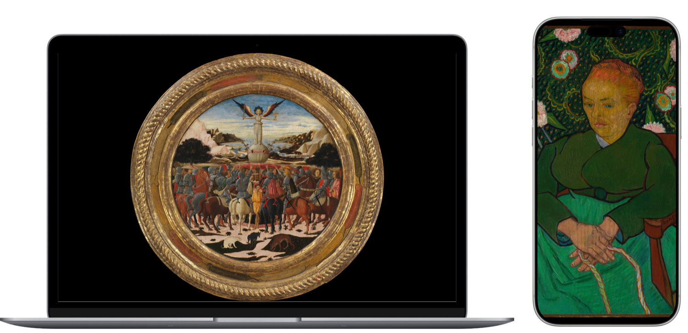
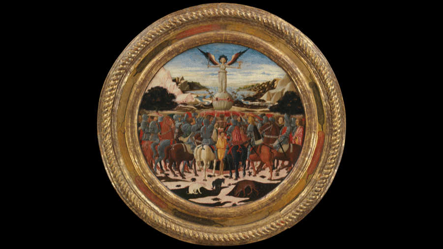

<!-- craft-readme: voice=quiet -->
<div align="center">

# Art Window

**A painting a day. Never cropped.**

Art Window puts one public-domain painting on your desktop each day, fit to the
screen with the margins filled black.

[](https://github.com/gr13nka/art-window/actions/workflows/ci.yml)
[](https://github.com/gr13nka/art-window/releases/latest)


[Guide](docs/GUIDE.md) · [Android](docs/android.md) · [The Met's API](https://metmuseum.github.io/)



</div>

<div align="center">

</div>

On a desktop a tall painting reads as a framed picture on a black wall. That is
what the letterboxing is for, so nothing on that side measures a picture's
proportions or crops one to fill. The phone is the deliberate exception below.

## Quick start with an agent

> Read `CLAUDE.md` first. Then run `cargo build --release` and `cargo test
> --all-targets` to check the checkout builds. Install it with `./macos/install.sh`
> on macOS or `./linux/install.sh` on GNOME, then run `./target/release/art-window
> --once` and show me the painting it printed.

## Quick start

A DMG, a Linux tarball and an Android APK are on the
[latest release page](https://github.com/gr13nka/art-window/releases/latest); the
commands below build from source instead.

Rust 1.88 or newer.

```sh
./macos/install.sh    # macOS: builds and replaces /Applications/Art Window.app
./linux/install.sh    # GNOME: user-local binary, launcher and icon
```

Open the app to put its framed-picture icon in the menu bar. On GNOME the GTK
window is the whole interface. A panel menu appears only where an AppIndicator
library and a StatusNotifier extension are present.

Debian and Arch need GTK and D-Bus development files first, and NixOS installs
from a `nix-shell`. [Every platform's install →](docs/GUIDE.md#install)

## Favourites

The cache holds one picture, and the next rotation deletes it. Adding a painting
to favourites copies it somewhere safe first, which is the only thing that keeps
it. A kept painting can go back on the desktop at any time, and choosing one by
hand leaves the day's schedule alone. [Every menu action →](docs/GUIDE.md#interface)

## Android

A native Kotlin app under `android/`, sharing no code with the Rust side. It sets
the home and lock screen wallpaper, and fills the screen rather than letterboxing:
a phone is too narrow for black margins to read as anything but a stripe, so it
picks only paintings tall enough for that to look right.

```sh
./android/install.sh    # builds the debug APK and installs it over adb
```

A signed APK is also on the
[latest release page](https://github.com/gr13nka/art-window/releases/latest).

[Art Window for Android →](docs/android.md)

## Questions

**Windows?** Not implemented. The platform seams under `desktop/`, `gallery/`,
`day` and `wake` are there for it. The backend has not been written.

**What happens when the machine is asleep at midnight?** Art Window compares
calendar dates rather than counting hours. A machine that sleeps through several
days wakes owing a single painting.

**How much traffic is this?** One search and one image download a day, from the
Metropolitan Museum's open-access API.

**Can I use my own pictures?** Point `source` at a folder in `config.toml`. Art
Window deletes only files it downloaded itself, so a folder of your own pictures
is never pruned. [Settings →](docs/GUIDE.md#settings)

**Why is the wallpaper right on one Space and not the others?** macOS keeps a
wallpaper per Mission Control Space per display. The Space in front of you is set
at once. The rest are published when the desktop was going to be redrawn anyway,
because publishing them blanks every desktop for as long as the Dock takes to
restart.

## Docs

[The guide](docs/GUIDE.md) carries the rest: [install](docs/GUIDE.md#install),
[the menu and the favourites window](docs/GUIDE.md#interface),
[the command-line flags](docs/GUIDE.md#use),
[settings](docs/GUIDE.md#settings) and [uninstall](docs/GUIDE.md#uninstall).

Two notes on the platform wallpaper APIs sit beside it:
[macOS](docs/macos-wallpaper.md) and [GNOME](docs/gnome-wallpaper.md).

## Credits

Artwork metadata and images come from [The Metropolitan Museum of Art Collection
API](https://metmuseum.github.io/), under its open-access terms. Inspired by
[Muzei](https://github.com/romannurik/muzei) by Roman Nurik and its
[macOS port](https://github.com/naman14/Muzei-macOS) by Naman Dwivedi. This is an
independent rewrite and shares no code with either. The device frames in the
picture above come from [frames](https://github.com/bunlongheng/frames), MIT.

MIT or Apache-2.0, at your option.
